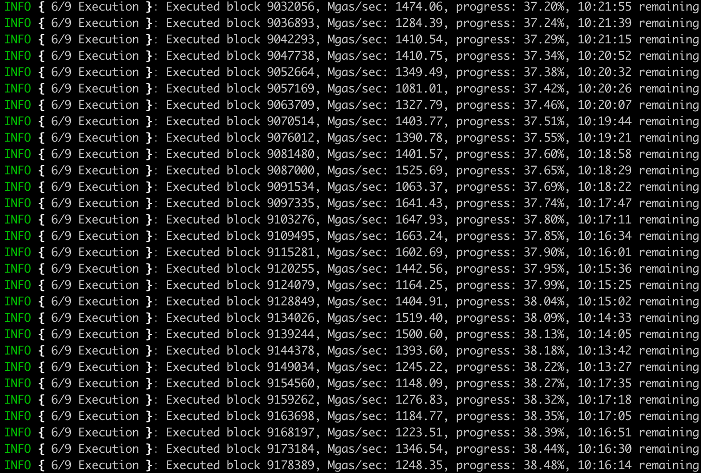

# <h1 align="center"> 🦈 Akula 🦈 </h1>
[](https://t.me/akula_bft)

Next-generation implementation of Ethereum protocol ("client") written in Rust, based on [Erigon architecture](https://github.com/ledgerwatch/interfaces).

## Why run Akula?




## Building the source

Install `rustup` from rustup.rs.

```
git clone https://github.com/akula-bft/akula

cd akula

cargo build --all --release
```

You can find built binaries in `target/release` folder.

## Running

* `akula` takes an _already synced_ [Erigon](https://github.com/ledgerwatch/erigon) database with downloaded blocks and headers (stages 1-3), imports them, executes and verifies state root:

```
akula --datadir=<path to Akula database directory> --erigon-datadir=<path to Erigon database directory>
```

* `akula-toolbox` provides various helper commands to check and manipulate Akula's database. Please consult its help for more info:
```
akula-toolbox --help
```

---
Akula (_Акула_) stands for _shark_ in Russian.
