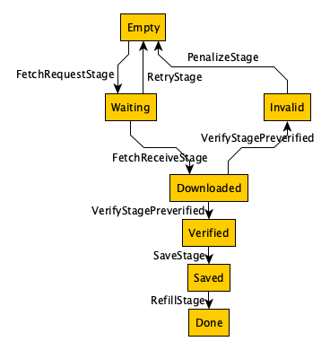

# Header downloader spec

The download process has 3 phases: preverified, linear and forky.

    block numbers = [0, 1, 2, …, PN, PN + 1, PN + 2, …, LN, LN + 1, …, M]

The preverified phase downloads headers with block numbers from 0 to PN. It gets the headers that are known to be trusted in advance when the code was compiled. The point of splitting this phase is that verification is fastest here.

The linear phase continues to download from PN up to a certain block number - LN. LN is chosen in a way that the possibility of forks before LN is minimal. The point of splitting this phase is that verification is simpler and faster, because it can be implemented with more assumptions than in the forky phase.

Then a forky phase takes over. This phase tries to get all the remaining headers (and goes on forever). In this phase it is possible to observe a tree of forks, and branch death as the main branch continues.

## Phase 1: “preverified”

The source code contains a list of P + 1 hardcoded block hashes that are known to be valid (i.e. preverified):

* preverified hash of block 0
* preverified hash of block 192
* preverified hash of block 384
* …
* preverified hash of block P * 192

The GetBlockHeaders message allows requesting a continuous slice of headers, so we can request all blocks between the preverified ones:

* get headers slice in range [0, 192]
* get headers slice in range [192, 384]
* …

It is easy to verify each slice by comparing the hashes of the first and last headers to preverified hashes, and comparing that the child.parent_hash = hash(parent) for the intermediate headers. If the verification fails, the peer that sent this slice is penalized, and the slice is requested again (from a different peer).

Slice fetching and verification is performed in a number of stages. Each stage processes slices that reached an expected status (HeaderSliceStatus), and transitions them to the next status (according to the picture). Each stage operates on a set of slices in some state - input state. If there are no slices in the input state, it waits (using `await`). As soon as there are slices in this state, it awakes and processes them. Note that this is a pipeline that works in parallel: for example, if a slice A is Waiting and just received from sentry, slice B is already Downloaded before and needs to be verified, and slice C is already Verified and needs to be saved, all 3 operations on different slices can be done in parallel. This is beneficial, if A is network-bound, B is CPU-bound and C is IO-bound.



Storing all P slices in memory is not possible, so instead a sliding window approach is used. We allocate a window of W slices (HeaderSlices), and this window is moved forward from slice 0 to slice P - W. It is possible to control the size of W using `downloader.headers-mem-limit` parameter. When blocks at the left side of the window are fetched, verified and saved to the database, they are evicted from memory (RefillStage) and the window moves to the higher block numbers.

```
  S0  - saved and evicted
  S1  - saved and evicted
  S2  - saved and evicted
W[S3] - Empty
W[S4] - Waiting
W[S5] - Verified
  S6  - pending
  S7  - pending
  S8  - pending
  S9  - pending
```

In this example the window contains 3 slices from S3 to S5. The slices before S3 are already processed and saved. The slices after S5 are waiting to be processed in the future. The slices within the window can have any status: they start in the Empty status, and are processed according to the state machine above.

When all P slices are obtained, the process stops and switches to the next phase.

## Phase 2: “linear”

### TopBlockEstimateStage

We run a task that estimates M - the current known max block number. This task listens for incoming NewBlockHashes messages and takes the average. We shouldn’t take the maximum, because a rogue node might send a fake number.

### LN calculation

We need to estimate the minimum number of blocks T before block M where it is still possible to have forks. Then:

    LN = M - T

A conservative limit is T=90K blocks, because it is trusted that all forks from that time are consolidated into the canonical chain.

### Downloading


Using the same approach as phase 1, we start downloading block headers from PN to LN. The verification stage is different, because we don’t have preverified hashes to rely on. Additional checks of the header structure validity are needed so that we don’t waste time on saving and redownloading:

* block numbers are sequential
* timestamps are the past, and monotonic
* difficulty matches the [CalcDifficulty formulas](https://github.com/ledgerwatch/erigon/blob/devel/consensus/ethash/consensus.go#L350)
* PoW is verified (see [verifySeal](https://github.com/ledgerwatch/erigon/blob/devel/consensus/ethash/consensus.go#L539) or [rust ethash](https://github.com/rust-ethereum/ethash))

Those verifications for blocks within a single slice can be performed on multiple slices in parallel (opportunistically). Such slices are not connected to each other yet, but they get an intermediate "VerifiedInternally" status. Once the leftmost slice reaches this status, it can be connected to the trusted parent, and transition to Verified.

In order to finalize the verification of a slice, we need to “connect” it to the left side of the sliding window using the formula `lefmost.parent_hash = hash(lefmost_parent)`, because the left side is assumed to be verified at all times. If it fails to connect, the peer who sent this slice is penalized, and the slice is requested again (from a different peer).

### Phase 3: “forky”

TBD: tree, anchors, branch management.

see [erigon header downloader docs](https://github.com/ledgerwatch/erigon/wiki/Header-downloader)
